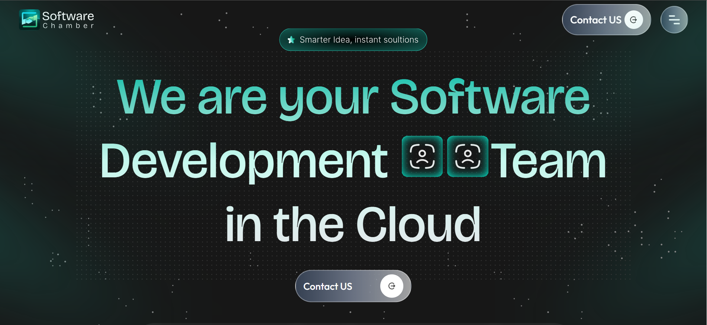

# Software Chamber - Web Development Agency



## 🚀 Live Demo

<!-- [](https://software-chamber-demo.netlify.app/) -->

🔗 **Live Preview:** [https://ns-software-chamber.vercel.app]

## ✨ Features

- Modern responsive design
- Interactive service showcases
- Animated statistics counters
- Smooth page transitions
- Optimized performance

## 🛠 Tech Stack

| Category      | Technologies                            |
| ------------- | --------------------------------------- |
| Core          | React 18, TypeScript, Tailwind CSS      |
| Routing       | React Router v6                         |
| UI Components | Swiper JS, React Marquee, Framer Motion |
| State         | React Context API                       |
| Build         | Vite                                    |

## 📦 Installation

1. Clone the repository:

```bash
https://github.com/nirobsarker012/software-chamber.git
```
